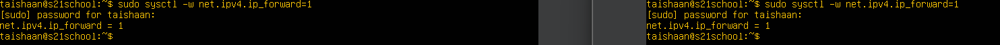
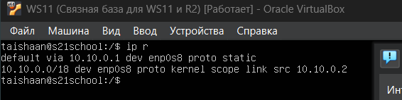
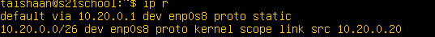
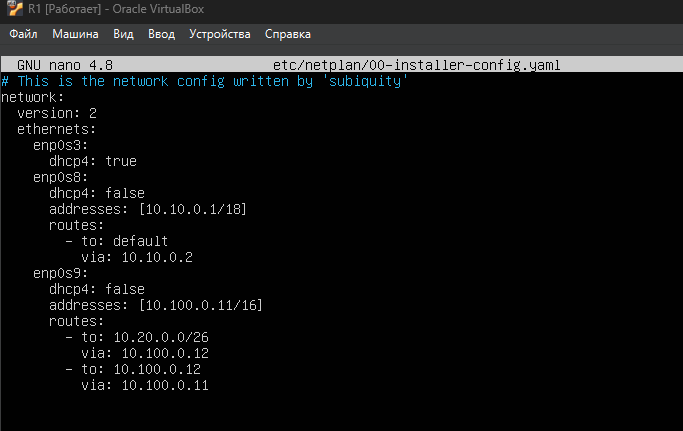

## Part 1. Инструмент ipcalc

- ### 1.1. Сети и маски

*Результат выполнения команды ipcalc*


1. **Адресс сети:** 192.160.0.0/13

2. **Перевод масок:**

    + **Маска 255.255.255.0:**

        

        + *В префиксной записи -* /24

        + *В двоичной записи -* 11111111.11111111.11111111

    + **Маска /15:**

        

        + *В обычной записи -* 255.254.0.0

        + *В двоичной записи -* 11111111.1111111 0.00000000.00000000

    + **Маска 11111111.11111111.11111111.11110000*:*

        

        + *В обычной записи -* 255.255.255.240

        + *В префиксной записи -* /28

3. **Минимальный и максимальный хост сети 12.167.38.4:**

    + *При маске /8 -* 192.0.0.1\192.255.255.254

        

    + *При маске 11111111.11111111.00000000.00000000 -* 192.167.0.1\192.167.255.254

        

    + *При маске 255.255.254.0 -* 192.167.38.1\192.167.39.254

        

    + *При маске /4 -* 192.0.0.1\207.255.255.254

        

- ### 1.2. localhost

**Орделение возможности обращения к приложению работающему на localhost со следующими ip:**

+ *194.34.23.100 -* нет

+ *127.0.0.2 -* да

+ *127.1.0.1 -* да

+ *128.0.0.1 -* нет

- ### 1.3 Диапозоны и сегменты сетей

1. **Какие из перечисленных IP можно использовать в качестве публичного, а какие только в качестве частных:**

    + *10.0.0.45 -* частный

    + *134.43.0.2 -* публичный

    + *192.168.4.2 -* частный

    + *172.20.250.4 -* частный

    + *172.0.2.1 -* публичный

    + *192.172.0.1 -* публичный

    + *172.68.0.2 -* публичный

    + *172.16.255.255 -* частный

    + *10.10.10.10 -* частный

    + *192.169.168.1 -* публичный

2. **Какие из перечисленных IP-адресов шлюза возможны у сети *10.10.0.0/18:***

    + *10.0.0.1 -* нет

    + *10.10.0.2 -* да

    + *10.10.10.10 -* да

    + *10.10.100.1 -* нет

    + *10.10.1.255 -* да

## Part 2. Статическая маршрутизация между двумя машинами

**Вызов и использование команды ip a**


**Изменение etc/netplan/00-installer-config.yaml для каждой машины**


**Использование команды netplan apply для обеих машин**


- ### 2.1. Добавление статического маршрута вручную

    #### Добавляем статическую маршрутизацию:

    От VM1 к VM2:

     ```bush
    ip r add sudo ip r add 172.24.116.8 dev enp0s3
    ```

    От VM2 к VM1:

    ```bush
    sudo ip r add 192.168.100.10 dev enp0s3
     ```

    

    #### Пропингуем соединение между машинами

    Для того, чтобы проверить соединение между машинами, используем команду ping

    ```bush
    ping [ip - адресс хоста]
    ```

    **Полученный результат в консоли**

    

- ### 2.2. Добавление статического маршрута с сохранением

    #### Перезапускаем машину

    *Перезапускаем машину с помощью команды -* `sudo reboot`

    #### Добавляем статический маршрут от одной машины к другой
    
    Для того, чтобы добавить статический маршрут, мы должны обратиться к файлу - `/etc/netplan/00-installer-config.yaml`

    **Изменение конфигураций `00-installer-config.yaml`**

    

    Далее сохраним изменения с помощью команды `netplan apply`

    #### Пропингуем соединение между машинами

    

## Part 3. Утилита **iperf3**

- ### 3.1. Скорость соединения

    + 8 Mbps - `1 MB/s`
    
    + 100 MB/s - `100 * 8 * 10^3 KBps`
    
    + 1 Gbps - `1 * 10^3 Mbps`

- ### 3.2. Утилита **iperf3**

    Для начала установим на обе машины утилиту iperf с попомщью команды `sudo apt-get isntall iperf3`

    **Настроим первую виртуальную машину в качестве сервера**

    

    **Настроим вторую машину в качестве клиента и установим соединение**

    

## Part 4. Сетевой экран

- ### 4.1. Утилита **iptables**

    1. Создаем файл */etc/firewall.sh*, имитирующий файрвол на обеих машинах

    

    2. Добавляем в файл следующие правила

    

    3. Запускаем файл на обеих машинах и выводим правила

    

    >В результате выполнения мы получили 2 принципиально разные политики выполнения. В первом случае мы запретили пинговать сервер и открыли его на портах ssh и http. Такое поведение нужно, чтобы ограничить возможность отправки всевозможных пакетов данных на сервер, это повышает безопасность и уменьшает количество ошибок. Во втором случае мы сразу же открывам сервер для всех пакетов и далее явно указываем открытие на портах 22 и 80. Такое поведение увеличивает гибкость сервера.

- ### 4.2. Утилита **nmap**

    **Пингуем обе машины и замечаем, что 1 машина не получает эхо - запросы**

    

    **Проверяем хост с помощью утилиты nmap**

    

## Part 5. Статическая маршрутизация сети

**Для начала настройки сети поднимаем 3 виртуальные машины и 2 роутера**


- ### 5.1. Настройка адресов машин

    **Настройка ws11**

     

    **Настройка ws21**

    

    **Настройка ws22**

    

    **Настройка r1**

    

    **Настройка r2**

    

    #### С помощью команды *ip -4* проверим конфигурации сети для каждой машины

        **Для WS11**

    

        **Для R1**

    

        **Для R2**

    

        **Для WS21**

    

        **Для WS22**

    

   **Пропингуем ws22 с ws21**

    

    **Пропингуем r1 с ws11**

    


- ### 5.2. Включение переадресации IP-адресов

    **Включаем переадресацию на обоих роутерах**

    

    **Изменение файла */etc/sysctl.conf***

    

- ### 5.3. Установка маршрута по умолчанию

    #### Настройка маршрута по умолчанию

    **Для WS11**

    

    **Для WS21**

       

    
    **Для WS22**

    

    #### Проверка того, что маршрут действительно добавился в таблицу маршрутизации

    **Для WS11**

    

    **Для WS21**

    

    **Для WS22**

    

    #### Пропингуем R2 с WS11

    

    **Проверим, что запросы доходят до R2**

    

- ### 5.4. Добавление статических маршрутов

    **Для R1**

    

    **Для R2**

    

    #### Вызов *ip r*

    **Для R1**

    

    **Для R2**

    

    #### Запуск команд *ip r list 10.10.0.0/[маска сети]* и *ip r list 0.0.0.0/0*

    

    >В результате выполнения первой команды получилось, что был выбран маршрут 10.10.0.2. Это связано с тем, что заданные параметры сети более конкретные, маска более узкая и вариантов для ip выхода в сеть меньше. Во втором варианте диапозон выходов в сеть очень большой, по этому система использует маршрут по умолчанию `proto static`

- ### 5.5. Построение списка маршрутизаторов

    #### Запуск на r1 команды дампа:

    

    #### Утилита *traceroute*

    

    >Построение путей с помощью команды traceroute основывается на следующем принципе. `traceroute` отправляет пакеты до указанного адреса, постепенно увеличивая TTL (time to live) пакета. Каждый раз, когда TTL достигает 0, проходя через узлы в сети, хост, на котором закончилась жизнь пакета, выбрасывает код ошибки и свой ip-адрес. Таким образом traceroute выстраивает полный путь до адреса назначения.

- ### 5.6. Использование протокола **ICMP** при маршрутизации

    #### Запускаем на r1 перехват сетевого трафика, проходящего через eth0 с помощью команды `tcpdump -n -i eth0 icmp`

    

    #### Пингуем с ws11 несуществующий IP

    

## Part 6. Динамическая настройка IP с помощью **DHCP**

1. **Для R2 настроим файл */etc/dhcp/dhcpd.conf***

    

2. В файле *resolv.conf* пропишем DNS - сервер `8.8.8.8`

    

3. Перезагрузим службу **DHCP** c помощью команды `systemctl restart isc-dhcp-server`

4. Перзапускаем WS11 и проверяем, что она получила адресс

    

5. Пропингуем WS22 c WS11

    

6. Укажем MAC - адресс машины WS11

    

7. Настройка параметров DHCP для R1

    

8. Перезагрузим службу **DHCP** c помощью команды `systemctl restart isc-dhcp-server`

9. В файле *resolv.conf* пропишем DNS - сервер `8.8.8.8`

    

10. Пропингуем WS21 c WS11

    

11. IP на WS21 до обновления

    

12. IP на WS21 после обновления

    

**В этом разделе используются следующие параметры DHCP-сервера:**

*subnet* — определяет подсеть, для которой настраивается DHCP-сервер.
*netmask* — указывает маску подсети для соответствующей подсети.
*range* — определяет диапазон IP-адресов, которые будут выдаваться DHCP-сервером клиентам в соответствующей подсети.
*option routers* — указывает IP-адрес шлюза по умолчанию для клиентов в соответствующей подсети.
o*ption domain-name-servers* — указывает IP-адрес DNS-сервера для клиентов в соответствующей подсети.
*host* — определяет конфигурацию для конкретного клиента, идентифицируемого по MAC-адресу сетевого интерфейса.
*hardware ethernet* — указывает MAC-адрес сетевого интерфейса клиента.
*fixed-address* — определяет IP-адрес, который будет назначен конкретному клиенту.

## Part 7. **NAT**

- ### Сделаем сервер apache доступным

    **Для WS22**

    

    **Для R1**

    

- ### Запустим веб-сервер Apache командой `service apache2 start` на ws22 и r1.

- ### Добавление и настройка файрвола на R2

    

- ### Проверяем соединение между WS22 и R1 командой `ping`

    

- ### Разрешаем маршрутизацию пакетов *ICMP*

    

- ### Повторно роверяем соединение между WS22 и R1 командой `ping`

    

- ### Включение SNAT и DNAT

    

- ###  Проверяем соединение по TCP для `SNAT`

    

- ### Проверяем соединение по TCP для `DNAT`

    